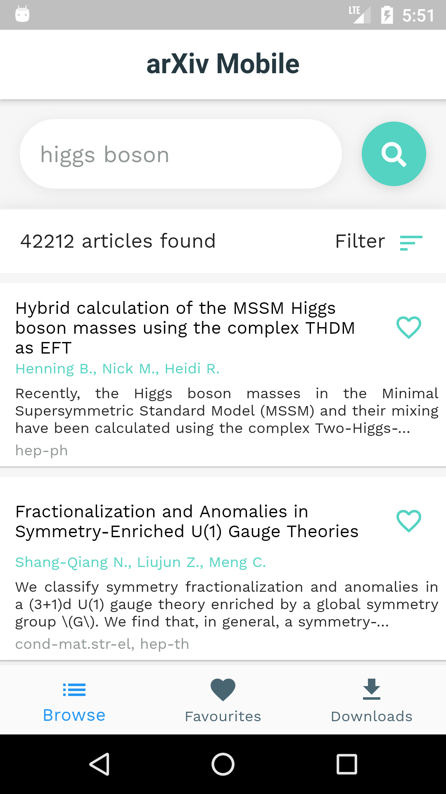
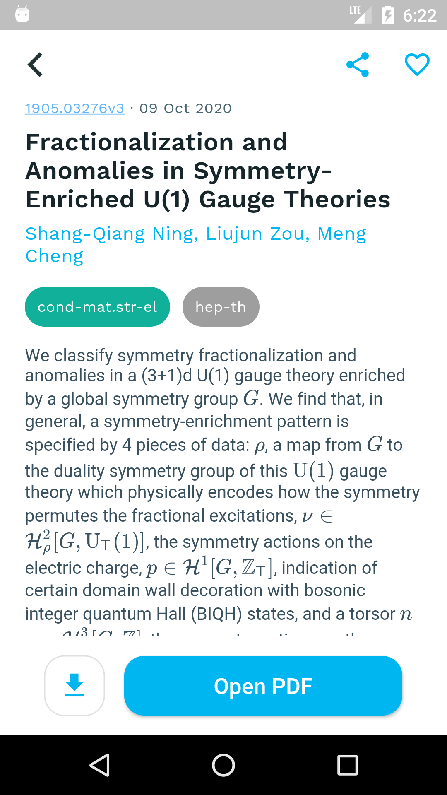
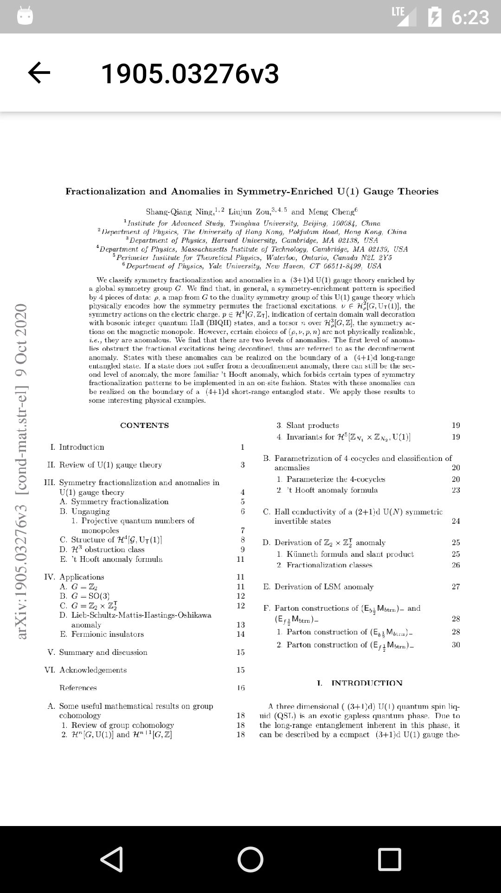

# ArXiv Mobile 

ArXiv Mobile allows users to browse, save, and read preprints listed on arXiv straight from their mobile devices. ArXiv Mobile provides users the option to read papers without having to download the PDF onto their phones.

## Features

### Browsing articles

Users can browse and search for articles in the "Browse" tab.

    

### Add to favourites or download articles

Users can curate their own list of articles by adding articles to their "Favourites" list. Additionally, articles are also available for download for easier offline access.

    

### Read PDFs without downloading

Users can open and read ArXiv papers straight from within the app, without having to download the pdf onto their phones. This makes it easier for the user to browse and read PDFs without having to commit to downloading it onto their devices.

    

## Getting Started

These instructions will get you a copy of the project up and running on your local machine for development and testing purposes.

## Built with

- [Flutter](https://flutter.dev/)

## Author

- **Raphael Koh** - [raphaelkoh.me](https://www.raphaelkoh.me)

## License

This project is licensed under the MIT License - see the [LICENSE.md](LICENSE.md) file for details

## Acknowledgments

- [Best-Flutter-UI-Templates](https://github.com/mitesh77/Best-Flutter-UI-Templates) for providing me with the base template for this app
- [Aggie Branczyk](https://www.agatabranczyk.com/) who wrote [a post](https://www.linkedin.com/posts/agata-branczyk_research-quantumcomputing-activity-6706954960371875841-ekEj) on how to find a new research project in quantum information, which indirectly gave me the idea for this app
- [Scott Aaronson](https://www.scottaaronson.com/blog/?p=4684#comment-1833687) who came up with the strategy for coming up with project ideas in quantum information
